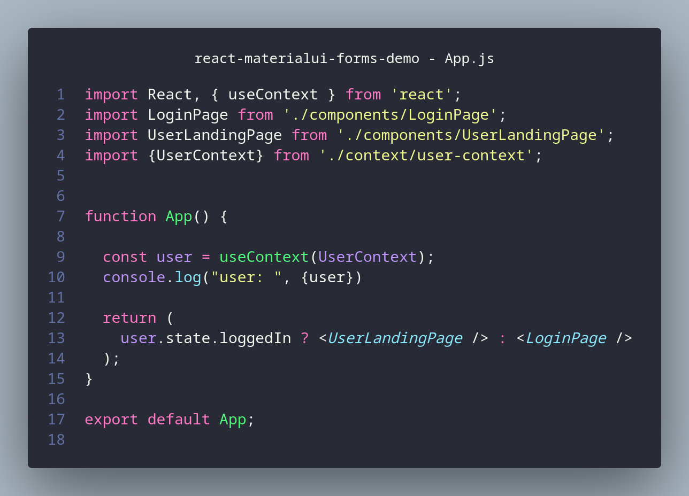

# Demonstration of a React Web App using Material UI forms with react-hook-form

I still consider myself relatively new to front-end development (as of end 2020). All my experience was always more on the back-end and I only occasionally implemented some very basic front-ends when absolutely required. It's fair to say that my front-end expereince was limited to front-end implementations that was just enough for my own use or for a very limited user base. It usually consisted of just plain HTML, minimal to no CSS and very sparse use of JavaScript. Security was usually not a big concern. 

Now in 2020 I started taking front-end development more seriously. I settled on learning React and there are some other projects scattered around my GitHub repo with some React projects. However, this project is special to me as I am finally getting to the point where I think I'm understanding most of the major concepts. I am still a bit unsure of certain implementation best practices and this is what this specific project is for.

I am sharing all my code online as a reference for myself as well as perhaps some help to other individuals on the same journey.

I welcome any suggestion for improvement, especially when it comes to best-practices, patterns etc. For this purpose I propose for now you [open a new issue](https://github.com/nicc777/react-materialui-forms-demo/issues), or [engage in a discussion](https://github.com/nicc777/react-materialui-forms-demo/discussions), or you could also just submit a pull request.

This demonstration was originally based on the blog entry of William Kurniawan titled "_[Building a simple login form with Material UI and React Hook Form](https://www.williamkurniawan.com/blog/building-a-simple-login-form-with-material-ui-and-react-hook-form)_", but it has been heavily modified by now. I still would like to give credit to William as his blog entry was a great help.

I was looking for a simpler way to collect form data using Material UI and sofar this is my favorite. `react-hook-form` eliminates the need to keep form data in state and keeps your codebase light.

This is the second iteration of this project where I added various features on top of the original concept. The new features include:

* A _profile_ page (`UserLandingPage`) which is rendered if a valid JWT access token is present. All calls to a back-end server is simulated.
* The `App` component was modified to display either the `LoginPage` or `UserLandingPage` depending on the JWT Access Token Validation state
* The `LoginPage` component will simulate a service call to the login server. A dummy/test JWT is generated.
* In addition, an incorrect login (invalid credentials) can be simulated by using the password "_thisiswrong_"
* Some UI elements were added to display appropriate error messages
* I used the "new" [React Context](https://reactjs.org/docs/context.html) features with [React Hooks](https://reactjs.org/docs/hooks-intro.html). The implementation was based on [the blog entry](https://blog.logrocket.com/use-hooks-and-context-not-react-and-redux/) from Ebenezer Don as an alternative from Redux.
* The JWT Access Token is persisted in the [browsers local storage](https://developer.mozilla.org/en-US/docs/Web/API/Window/localStorage).
* Local storage is also used to cache the username. The username will be auto filled the next time the page is visited.
* Add a "_remember me_" option to optionally store the username in the local storage
* Added a diagram and other supporting material to better explain the implementation and patterns

There are still some enhancement outstanding which I will address in the near future as part of my learning exercise:

* Using the [Storybook](https://storybook.js.org/docs/react/get-started/introduction) features.
* Implement unit tests
* I am considering adding a real back-end for testing purposes. This may be useful to practice some security best practices as well.

## Quick Start

```bash
$ git clone https://github.com/nicc777/react-materialui-forms-demo.git
$ cd react-materialui-forms-demo
$ yarn && yarn start
```

If your browser did not automatically open, navigate to http://localhost:3000 

Enable your browser's development tools and watch the `console` output for some interesting additional info. You can also checkout the values in local storage to see what changes during login and logout processing.

## Project Design Overview


### User Context - Using React Context (in stead of Redux)

The file `user-context.js` and how it is implemented in some of the other components should be noteworthy. Where to start with the explination is a little more tricky.

I'm going to start with "what" (the "data") will be exposed before we go to the mechanics.

The basic data structure with a bare minimal startup value is defined as shown in the following code snippet:


A generic component would access the context (READ ONLY) as follows:

**Step 1:** Import the user context with `import {UserContext} from './context/user-context';`

**Step 2:** In your functional component, define a constant with the context for example using the line `const user = useContext(UserContext);`

**Step 3:** Access the user context variables, as defined in the data structure for example: `user.state.loggedIn`

A complete example may look something like the `App.js` file:



But how is the `UserContext` build up after the application is being used? Or, in other words, assuming there are now cached values in `localStorage`, how do we use those values instead of the default values?

In the file `user-context.js` there is the following line:

```javascript
export const UserContext = createContext(is_user_session_valid(default_user_context));
```

The `UserContext` is initialized with `createContext` ([documentation](https://reactjs.org/docs/context.html#reactcreatecontext)).

I used a helper function called `is_user_session_valid` that will actually attempt to load and validate values from cache and modify the default user context values as required. The implementation is worthy of going through line by line:


**Line 62:** We attempt to retrieve the cached `username` (an email address) from `localStorage`. If the value is not defined, we initialize with a `null`

**Line 63:** Similar thing happens with the `accessToken`, which is the JWT access token we would receive after a successful login. **_Note:_** In this implementation all back-end or server operations are only simulated.

**Line 64:** If the user opted to be remembered when they logged in, the local `rememberMe` value will contain the STRING `true`. Many casual observers may not notice this, but here we actually TEST if the string is `true` (which will return a BOOLEAN value). If the string is not present, the default BOOLEAN value of `false` is used.

**Line 65 to 72:** Validation of the JWT token, if present/defined

**Line 66:** We call another helper function (`is_jwt_expired()`) to test if the JWT has expired. No point in loading the user landing page if we know before hand the JWT expired, which means all calls to the back-end or server will be rejected anyway.

**Line 67 to 69:** If the JWT is still valid, we will also store the decoded values. This is personal preference, as I believe that a typical application may refer to the JWT data several times and by calling `jwt_decode()` each time may just cause unnecessary application latency.

## Important Links

* [React](https://reactjs.org/)
* [Material UI](https://material-ui.com/)
* [react-hook-form](https://react-hook-form.com/) ([GitHub](https://github.com/react-hook-form/react-hook-form))

License: [MIT](https://raw.githubusercontent.com/nicc777/react-materialui-forms-demo/main/LICENSE) (_[WikiPedia](https://en.wikipedia.org/wiki/MIT_License)_)
